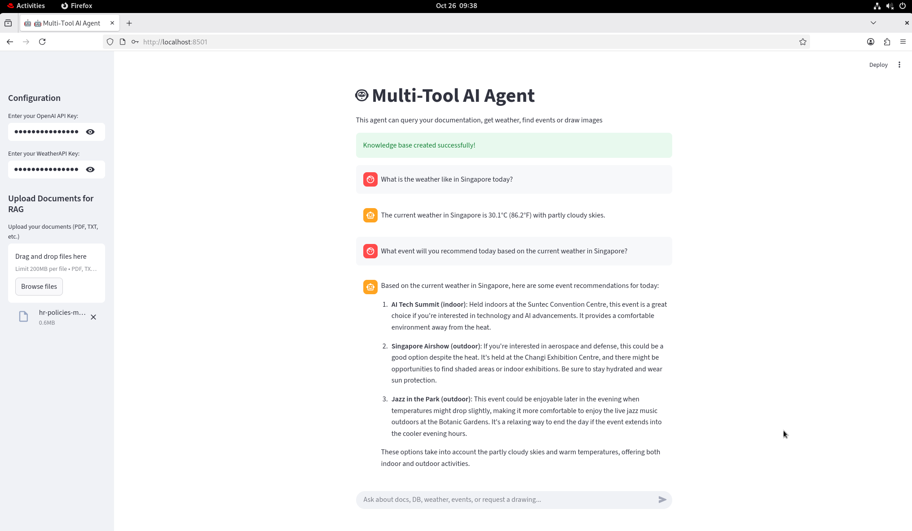

# Multi-Tool AI Agent Chatbot

**A Capstone Project for the NUS Generative AI: Fundamentals to Advanced Techniques Course**

This project demonstrates a multi-tool, multi-modal AI agent built with **LangChain** and **Streamlit**. The chatbot features a hierarchical agent design, where a central "planner" agent (powered by **GPT-4**) analyzes user requests and intelligently routes them to the correct specialized tool or sub-agent.

This single chatbot can:
* ✅ **Answer questions about company data** by querying an employee SQL database.
* ✅ **Recommend events** by querying an events SQL database.
* ✅ **Answer from a knowledge base (RAG)** by retrieving information from custom documents.
* ✅ **Get real-time weather forecasts** using a weather API.
* ✅ **Generate images** from a text-based prompt using DALL-E.
* ✅ **Hold a general conversation** for any other queries.




The demo video recording can be found at this [link](https://drive.google.com/file/d/11Y1__QVhuGFM56crwcZL8jXpS7x6BCIN/view?usp=drive_link).


---

## 🏗️ Project Architecture

This chatbot uses a "hierarchical agent" or "agent-of-agents" pattern. This is a powerful and efficient design that leverages different models and tools for specific tasks.

1.  **Web UI (Streamlit):** The user interacts with a chat interface in `app.py`.
2.  **Main Agent (GPT-4):** A primary "planner" agent, built using LangChain's `create_react_agent`, receives the user's query and the chat history. Its model is **GPT-4**, chosen for its superior reasoning ability to understand intent and route the request.
3.  **Tool Dispatch:** The GPT-4 agent's main job is to decide which tool to use. It has five distinct tools available:
    * **`Company SQL Agent` (Agent-as-Tool):** A specialized sub-agent for all company-related questions.
    * **`Events Recommender Agent` (Agent-as-Tool):** A specialized sub-agent for all event-related questions.
    * **`Knowledge Base Retriever (RAG)` (Chain-as-Tool):** A retrieval-augmented generation (RAG) chain for answering questions from a private document set.
    * **`Weather Tool` (Function-as-Tool):** A function that calls a weather API to get current weather data.
    * **`Image Generation Tool` (Function-as-Tool):** A function that calls the DALL-E API to generate an image from a prompt.
4.  **Task Execution:**
    * **SQL Sub-Agents (GPT-3.5-Turbo):** If a SQL agent is chosen, the query is passed to that sub-agent. Both are created using LangChain's `create_sql_agent` and are powered by the more cost-effective **GPT-3.5-Turbo**. The sub-agent translates the query to SQL, executes it, and gets a result.
    * **RAG Chain:** If the RAG tool is chosen, the agent queries the vector database for relevant documents and uses them to synthesize an answer.
    * **Function Tools:** If the weather or image tool is chosen, the agent calls the corresponding Python function directly.
5.  **Final Response:** The result from the tool or sub-agent is used by the main GPT-4 agent to formulate a final, human-readable response for the user (which could be text, data, or an image).

This pattern leverages the strengths of different models: **GPT-4 for high-level reasoning and routing**, and **GPT-3.5-Turbo, RAG and APIs for task execution**.

---

## 🛠️ Technology Stack

* **AI/LLM Framework:** LangChain
* **LLMs:** OpenAI **GPT-4** (for the main agent) & **GPT-3.5-Turbo** (for the SQL sub-agents)
* **Image Generation:** OpenAI **DALL-E**
* **RAG Components:**
    * **Vector Database:** FAISS
    * **Embedding Models:** OpenAIEmbeddings
    * **Document Loaders / Text Splitters**
* **LangChain Components:** `create_react_agent`, `create_sql_agent`, `create_retrieval_chain`, `AgentExecutor`, `langchain-openai`
* **Web Frontend:** Streamlit
* **Database:** SQLite3
* **Environment:** `python-dotenv` for API key management

---

## ⚙️ Getting Started

### 1. Prerequisites

* Python 3.9
* An **OpenAI API Key** with access to GPT-4, GPT-3.5-Turbo, DALL-E, and Embedding models.
* A **Weather API Key** from [WeatherAPI](https://www.weatherapi.com/).

### 2. Installation

First, clone the repository and navigate into the project directory:

```bash
git clone https://github.com/eanylin/nus-genai-capstone-chatbot.git
cd nus-genai-capstone-chatbot
```

Next, create and activate a Python virtual environment:

```bash
python -m venv venv
source venv/bin/activate
```

Install all the required Python packages:

```bash
pip install -r requirements.txt
pip install --upgrade pip
```

### 3. Setup the Databases (SQL)

Run the two setup scripts to create and populate the SQLite databases for the SQL agents:

```bash
# This creates company.db
python setup_db.py

# This creates events.db
python setup_events_db.py
```

Ensure that `company.db` and `events.db` are now present in your directory.


### 4. Run the Application

You can now launch the Streamlit web application:

```bash
streamlit run app.py
```

Open your web browser and navigate to **[http://127.0.0.1:8501](http://127.0.0.1:8501)**. Key in the OpenAI and WeatherAPI API key to start chatting with the AI agent. The application supports RAG as well and we can upload documentation via the UI and start interacting with the AI agents.

---

## 🗄️ Database Schemas (For SQL Agents)

### `company.db`
* **Table:** `employees`
* **Columns:**
    * `id` (INTEGER): Employee ID
    * `name` (TEXT): Employee's name
    * `role` (TEXT): Job title
    * `department` (TEXT): Department (e.g., "Engineering", "Sales", "Finance")
    * `salary` (INTEGER): Annual salary

### `events.db`
* **Table:** `events`
* **Columns:**
    * `id` (INTEGER): Event ID
    * `name` (TEXT): Name of the event
    * `date` (TEXT): Date of the event (YYYY-MM-DD)
    * `location` (TEXT): Location of the event
    * `topic` (TEXT): Topic (e.g., "Tech", "Marketing", "Finance")

---

## 💡 Example Prompts

Once the application is running, try asking different types of questions to see the agent router in action:

* **Company SQL Agent Query:**
    * "How many people work in the Engineering department?"
    * "What is Jane Smith's salary?"
    * "List all employees in Sales, ordered by salary."

* **Events Recommender Agent Query:**
    * "Are there any tech events in Oct?"
    * "What marketing seminars are happening in Singapore?"
    * "Find all events on 2024-10-26."

* **RAG Knowledge Base Query:**
    * *(Assuming you have uploaded the documents)* "Summarize the 'Project Alpha' document for me."

* **Weather Tool Query:**
    * "What's the weather like in London right now?"
    * "How is the weather in Singapore?"

* **Image Generation Query:**
    * "Generate an image of a red panda wearing a space helmet."
    * "Create a picture of a futuristic city at sunset."

* **General Chit-Chat (Handled by Main Agent):**
    * "What is a Large Language Model?"
    * "Hello, how are you?"

## LICENSE

This project is licensed under the [MIT License](LICENSE).
